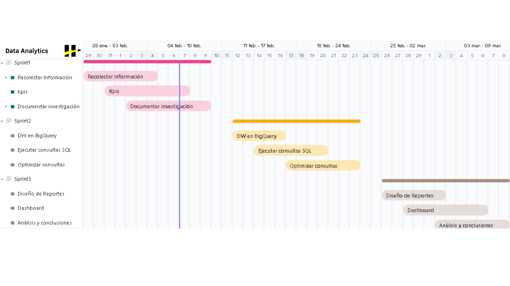

# **Data Analytics: HotelWise**

---

<strong>Índice</strong>

1. [Descripción del Producto](#descripcion-del-producto)
2. [Flujo de trabajo](#flujo-de-trabajo)
3. [Componentes Principales](#componentes-principales)
4. [Objetivo SMART Sprint 1](#objetivo-smart-sprint-1)
   - [Objetivo](#objetivo-2-semanas)
   - [SMART](#SMART-2-semanas)
   - [Acciones Asociadas](#acciones-asociadas-2-semanas)
5. [Objetivo SMART Sprint 2 y 3](#objetivo-smart-sprint-2-y-3)
   - [Objetivo](#objetivo-4-semanas)
   - [SMART](#SMART-4-semanas)
   - [Acciones Asociadas](#acciones-asociadas-4-semanas)
6. [KPIS](#kpis)
   1. [Cantidad Promedio de amenidades por Usuario en verano (basado en comentarios positivos)](#1.kpi-amenidades-verano)
        - [Fórmula](#formula-amenidades-verano)
        - [Objetivo Específico](#objetivo-amenidades-verano)
        - [Medición](#medicion-amenidades-verano)
        - [Datos Necesarios](#datos-amenidades-verano)
        - [Resumen y Conclusiones](#resumen-amenidades-verano)
   2. [Índice de Satisfacción del Usuario (CSAT)](#2.kpi-csat)
        - [Fórmula](#formula-csat)
        - [Objetivo Específico](#objetivo-csat)
        - [Medición](#medicion-csat)
        - [Datos Necesarios](#datos-csat)
        - [Resumen y Conclusiones](#resumen-csat)
   3. [Tasa de Conversión de Reservas de acuerdo a las amenidades](#3.kpi-tasa-de-conversion)
        - [Fórmula](#formula-tasa-de-conversion)
        - [Objetivo Específico](#objetivo-tasa-de-conversion)
        - [Medición](#medicion-tasa-de-conversion)
        - [Datos Necesarios](#datos-tasa-de-conversion)
        - [Resumen y Conclusiones](#resumen-tasa-de-conversion)
   4. [Índice de Retención de Usuarios (RIU)](#4.kpi-riu)
        - [Fórmula](#formula-riu)
        - [Objetivo Específico](#objetivo-riu)
        - [Medición](#medicion-riu)
        - [Datos Necesarios](#datos-riu)
        - [Resumen y Conclusiones](#resumen-riu)
   5. [Índice de Delitos por Área (IDA)](#5.kpi-ida)
        - [Fórmula](#formula-ida)
        - [Objetivo Específico](#objetivo-ida)
        - [Medición](#medicion-ida)
        - [Datos Necesarios](#datos-ida)
        - [Resumen y Conclusiones](#resumen-ida)
7. [Stack Tecnológico](#stack-tecnologico)
   - [BigQuery](#bigquery)
   - [Looker Studio](#looker-studio)
   - [ClickUp](#clickup)
   - [Integración de Tecnologías](#integracion-de-tecnologias)

## **Descripción del Producto**

---

En nuestro ámbito de Data Analytics, presentamremos productos enfocados en ofrecer análisis detallados y visualizaciones interactivas basadas en datos clave. Esto se logrará a través de un Data Warehouse en BigQuery, un Dashboard Interactivo en Looker Studio y análisis detallados que proporcionan una comprensión profunda de la información relevante. Estas herramientas permiten tomar decisiones estratégicas y fomentan la mejora continua en base a insights precisos.

## **Flujo de trabajo**

---

## **Componentes Principales**

---

#### 1. Base de Datos en BigQuery

Almacén de datos limpio y organizado que incluye información detallada sobre preferencias de usuarios, comentarios, amenidades de hoteles y más.

#### 2. Dashboard Interactivo en Looker Studio

Panel visual interactivo que ofrece métricas clave, tendencias y análisis detallados para evaluar la satisfacción del usuario, la tasa de conversión de reservas y otros KPIs específicos.

#### 3. Análisis Detallados

Información específica y detallada sobre la preferencia de amenidades durante la temporada de verano, el índice de satisfacción del usuario, la tasa de conversión de reservas y otros KPIs relevantes.

## **Objetivo SMART Sprint 1**

---

### Objetivo

En dos semanas, se ha dedicado tiempo al desarrollo de KPIs con los datos necesarios, la organización efectiva de objetivos, la investigación de información de otras plataformas para destacarse y la creación del README del proyecto.

### SMART

- **Específico (Specific):**

Se ha trabajado en el desarrollo de KPIs, la organización de objetivos, la investigación de información de otras plataformas y la creación del README en las últimas dos semanas.

- **Medible (Measurable):**

El progreso se mide por la finalización y organización efectiva de los KPIs, objetivos y el contenido del README.

- **Alcanzable (Achievable):**

La dedicación de tiempo y recursos a estas áreas es alcanzable en un periodo de dos semanas.

- **Relevante (Relevant):**

El desarrollo de KPIs, la organización de objetivos y la investigación de otras plataformas son actividades relevantes para el éxito del proyecto.

- **Temporal (Time-bound):**

Estas actividades se han llevado a cabo en dos semanas, demostrando un progreso reciente y continuo.

#### Acciones Asociadas

1. Desarrollo de KPIs y Organización de Objetivos.
   - Identificar y definir KPIs clave.
   - Organizar objetivos específicos para la fase de preparación de datos y creación de dashboard.

2. Investigación de Otras Plataformas.
   - Analizar plataformas similares para obtener información relevante y diferenciarse.

3. Creación del README.
   - Desarrollar un README completo que destaque los aspectos clave del proyecto.

## **Objetivo SMART Sprint 2 y 3**

---

### Objetivo

En las próximas dos semanas, realizar la preparación y organización efectiva de la base de datos en BigQuery. Posteriormente, en las siguientes dos semanas, crear un dashboard interactivo en Looker Studio que incluya análisis detallados y visualizaciones relevantes para respaldar la presentación del proyecto en el plazo de cuatro semanas.

### SMART

- **Específico (Specific):**

El objetivo se divide en dos fases claramente definidas: la preparación de datos en BigQuery en las primeras dos semanas y la creación de un dashboard interactivo en Looker Studio en las dos semanas siguientes.

- **Medible (Measurable):**

La calidad de la preparación de datos en BigQuery se medirá por la efectividad en la organización y limpieza de la base de datos. La creación del dashboard en Looker Studio se evaluará por la inclusión de análisis detallados y visualizaciones pertinentes.

- **Alcanzable (Achievable):**

La preparación de datos es alcanzable en dos semanas utilizando las funciones de limpieza y organización de BigQuery. La creación de un dashboard en Looker Studio en las siguientes dos semanas es factible con la herramienta de creación visual de informes y dashboards que ofrece la plataforma.

- **Relevante (Relevant):**

El objetivo es relevante para la presentación del proyecto, ya que la calidad de los datos y la presentación visual impactarán directamente en la percepción del comprador sobre la solidez y eficacia de la plataforma.

- **Temporal (Time-bound):**

Se establece un plazo de dos semanas para la preparación del Data Warehouse en BigQuery. Posteriormente, se destinarán dos semanas para la creación del dashboard en Looker Studio, lo que da un total de cuatro semanas para la consecución del objetivo.

#### Acciones Asociadas

1 . Preparación de Datos en BigQuery (Próximas dos semanas):

Identificar y corregir posibles problemas de calidad de datos.
Organizar la información en tablas y relaciones lógicas.
Realizar análisis exploratorio inicial para identificar patrones y tendencias.

2 . Creación de Dashboard en Looker Studio (Siguientes dos semanas):

Seleccionar las métricas clave a incluir en el dashboard.
Diseñar visualizaciones efectivas y comprensibles.
Integrar análisis detallados para respaldar puntos clave en la presentación del proyecto.

3 . Presentación del Proyecto (En las próximas cuatro semanas):

Explicar de manera efectiva los análisis realizados y los beneficios destacados por las visualizaciones.

## **KPIS**

---

### 1. **Cantidad Promedio de amenidades por Usuario en verano (basado en comentarios positivos)**

Proporcionará el promedio de la cantidad de amenidades preferidas por usuario durante la temporada de verano, lo que ayudará a comprender mejor las preferencias de los usuarios durante ese período específico.

#### Formula

Cantidad Promedio de Amenidades por Usuario en verano = (Total de amenidades preferidas durante el verano/ Total de usuarios que dejaron comentarios positivos sobre amenidades durante el verano)

- *Total de amenidades preferidas durante el verano*: Es la suma del número de amenidades mencionadas en los comentarios positivos durante la temporada de verano.

- *Total de usuarios que dejaron comentarios positivos sobre amenidades durante el verano*: Es la cantidad de usuarios que expresaron comentarios positivos relacionados con amenidades durante la temporada de verano.

#### Objetivo Específico

Evaluar las preferencias de los usuarios en cuanto a las amenidades durante la temporada de verano.

#### Medición

Recopilar comentarios de usuarios que mencionen amenidades durante la temporada de verano, calcular el promedio de amenidades preferidas por usuario y evaluar las preferencias generales.

#### Datos necesarios

- Comentarios de usuarios:
Comentarios de usuarios que contengan información sobre las amenidades que prefieren durante la temporada de verano. Estos comentarios deben estar asociados con cada usuario para calcular el promedio por usuario.

- Análisis de sentimiento:
Realizar un análisis de sentimiento en los comentarios para identificar aquellos que son positivos y están relacionados con las amenidades preferidas durante el verano.
Esto permitirá filtrar los comentarios relevantes para el cálculo del KPI.

- Temporada de verano:
Periodo de Junio a Agosto

- Conteo de amenidades:
Una vez identificados los comentarios positivos relacionados con las amenidades preferidas durante el verano, contar el número de amenidades mencionadas en cada comentario.

- Asociación con usuarios:
Asociar cada comentario con el usuario correspondiente para calcular el promedio por usuario.

Proporciona información valiosa sobre las preferencias de los usuarios en cuanto a las amenidades durante la temporada de verano, lo que puede ser útil para tomar decisiones informadas sobre la oferta de servicios durante ese período.

#### Resumen y Conclusiones

El análisis de la cantidad promedio de amenidades por usuario en verano proporciona una visión detallada de las preferencias de los usuarios durante la temporada estival, permitiendo a la plataforma adaptar su oferta de servicios de manera más precisa.

### 2. **Índice de Satisfacción del Usuario (CSAT)**

El Índice de Satisfacción del Usuario (CSAT) es una métrica que mide la satisfacción general de los usuarios con un producto o servicio. En el contexto de nuestra plataforma, podemos calcular el CSAT utilizando las reseñas y comentarios de los usuarios sobre su experiencia con los hoteles. Esta medida nos brinda información valiosa sobre la percepción general de los usuarios hacia los servicios ofrecidos. El CSAT nos ayuda a evaluar la calidad del servicio de manera integral, proporcionando una métrica cuantitativa de la satisfacción del usuario durante la temporada de verano. Esta evaluación continua nos permite identificar áreas de mejora y garantizar una mejora constante en la calidad del servicio ofrecido.

#### Fórmula

CSAT= (Total de comentarios positivos de satisfaccion/ Total de comentarios de usuarios evaluados) ×100

- *Total de comentarios positivos de satisfacción:* Es la cantidad de comentarios que se han identificado como positivos y están relacionados con la satisfacción del usuario durante la temporada de verano.

- *Total de comentarios de usuarios evaluados:* Es la cantidad total de comentarios de usuarios recopilados durante la temporada de verano.

#### Objetivo Específico

Evaluar la satisfacción de los usuarios a través de comentarios de usuarios recopilando puntuaciones de satisfacción.

#### Medición

Recopilar puntuaciones de satisfacción a través de comentarios de los usuarios y calcular un índice de satisfacción del usuario (CSAT).

#### Datos Necesarios

- Comentarios de Usuarios:
Recopilar comentarios de usuarios que contengan información sobre su satisfacción con el servicio.
 Estos comentarios deben estar asociados con cada usuario para calcular el CSAT por usuario.

- Análisis de Sentimiento:
Realizar un análisis de sentimiento en los comentarios para identificar aquellos que son positivos y están relacionados con la satisfacción del usuario.
Esto permitirá filtrar los comentarios relevantes para el cálculo del CSAT.

- Temporada de Verano:
El período de evaluación para el CSAT será durante la temporada de verano, que abarca desde junio hasta agosto.

- Conteo de Amenidades:
Una vez identificados los comentarios positivos relacionados con la satisfacción del usuario, se debe contar el número de menciones de satisfacción en cada comentario.

- Asociación con Usuarios:
Es esencial asociar cada comentario con el usuario correspondiente para calcular el CSAT por usuario.

#### Resumen y Conclusiones

El CSAT ofrece una medida clave de la satisfacción de los usuarios durante la temporada de verano, proporcionando información valiosa sobre la percepción general de los servicios ofrecidos y permitiendo mejoras continuas en la calidad del servicio.

### 3. **Tasa de Conversión de Reservas de acuerdo a las amenidades**

La Tasa de Conversión de Reservas de acuerdo a las amenidades representa el porcentaje de visitantes que dejaron un comentario positivo sobre un hotel junto con las amenidades que ofrece.

#### Fórmula

Tasa de Conversión de Reservas de acuerdo a las amenidades = (Total de usuarios con comentarios positivos y menciones de amenidades / Total de visitantes) ×100%

- *Total de usuarios con comentarios positivos y menciones de amenidades:* Es la cantidad de usuarios que dejaron comentarios positivos sobre un hotel junto con menciones de amenidades durante la temporada de verano.

- *Total de visitantes:* Es el total de visitantes que accedieron a la información del hotel durante la temporada de verano.

#### Objetivo Específico

Evaluar la efectividad de las amenidades ofrecidas por los hoteles en la conversión de reservas.

#### Medición

Recopilar comentarios de usuarios que mencionen amenidades durante la temporada de verano, identificar los comentarios positivos y calcular la tasa de conversión de reservas basada en dichos comentarios.

#### Datos Necesarios

- Comentarios de usuarios que mencionen amenidades durante la temporada de verano.
Necesitamos recopilar comentarios de usuarios que contengan información sobre las amenidades preferidas durante la temporada de verano. Estos comentarios deben estar asociados con cada usuario para calcular el promedio por usuario.

- Análisis de sentimiento para identificar comentarios positivos.
Realizaremos un análisis de sentimiento en los comentarios para identificar aquellos que son positivos y están relacionados con las amenidades preferidas durante el verano. Esto nos permitirá filtrar los comentarios relevantes para el cálculo del KPI.

- Temporada de verano definida como junio a agosto.
La temporada de verano se define como el período de junio a agosto.

- Conteo de amenidades en cada comentario.
Una vez identificados los comentarios positivos relacionados con las amenidades preferidas durante el verano, contaremos el número de amenidades mencionadas en cada comentario.

- Asociación de cada comentario con el usuario correspondiente.
Es importante asociar cada comentario con el usuario correspondiente para calcular el promedio por usuario.

#### Resumen y Conclusiones

La tasa de conversión de reservas según las amenidades proporciona información valiosa sobre cómo las características ofrecidas por los hoteles influyen en las decisiones de reserva de los usuarios, permitiendo ajustes estratégicos para maximizar la eficacia de las ofertas de servicios.

### 4. **Índice de Retención de Usuarios (RIU)**

El Índice de Retención de Usuarios (RIU) es una métrica crucial que evalúa la fidelidad y la satisfacción de los usuarios con la plataforma a lo largo del tiempo. Este indicador nos permite comprender cuántos usuarios regresan a utilizar la plataforma después de su primera experiencia y cuántos permanecen como usuarios activos durante un periodo determinado, como la temporada de verano.

#### Fórmula

RIU = ((Usuarios activos al final del periodo - Nuevos usuarios)\Usuarios activos al inicio del periodo) X 100

- *Usuarios activos al final del periodo:* Es el número de usuarios que siguen utilizando la plataforma al final del periodo de evaluación, que en este caso sería al final del verano.

- *Nuevos usuarios:* Representa la cantidad de usuarios que se registraron y comenzaron a utilizar la plataforma durante el periodo de evaluación.

- *Usuarios activos al inicio del periodo:* Indica el número de usuarios que ya estaban utilizando la plataforma al comienzo del periodo de evaluación.

#### Objetivo Específico

Medir la capacidad de retención de la plataforma y evaluar la satisfacción de los usuarios a lo largo del tiempo.

#### Medición

Calcular el Índice de Retención de Usuarios al final de la temporada de verano y compararlo con periodos anteriores para identificar tendencias y áreas de mejora.

#### Datos Necesarios

- Registro de usuarios: Mantener un registro de los nuevos usuarios que se registran durante el periodo de evaluación.

- Actividad de usuarios: Seguir la actividad de los usuarios para determinar quiénes siguen utilizando la plataforma de manera activa al final del periodo.

- Análisis comparativo: Comparar el número de usuarios activos al final del periodo con el número de nuevos usuarios y usuarios activos al inicio del periodo para calcular el RIU.

#### Resumen y Conclusiones

El Índice de Retención de Usuarios proporcionará información valiosa sobre la lealtad y la satisfacción de los usuarios con la plataforma, permitiendo identificar áreas de mejora y estrategias para aumentar la retención de usuarios a largo plazo.

### 5. **Índice de Delitos por Área (IDA)**

El Índice de Delitos por Área (IDA) es una métrica que evalúa la incidencia de delitos en una zona geográfica específica, lo que proporciona una medida relativa de la seguridad en esa área. Este KPI es útil para que los usuarios puedan evaluar el nivel de seguridad de la zona donde se encuentra un hotel y tomar decisiones informadas al seleccionar su alojamiento.

#### Fórmula

IDA = (Total de delitos en la zona\Población total de la zona) x 1000

- *Total de delitos en la zona:* Es la cantidad total de delitos reportados en la zona durante un período específico.

- *Población total de la zona:* Representa la población total que habita en la zona durante el mismo período.

#### Objetivo Específico

Evaluar la incidencia de delitos en una zona geográfica específica para proporcionar información sobre la seguridad en esa área.

#### Medición

Calcular el Índice de Delitos por Área (IDA) mediante la fórmula proporcionada, que relaciona el total de delitos en la zona con la población total de la misma durante un período específico.

#### Datos Necesarios

- Registros de delitos: Mantener un registro de todos los delitos reportados en la zona geográfica de interés durante el período de evaluación.

- Datos demográficos: Obtener información precisa sobre la población total que habita en la zona durante el mismo período de tiempo.

#### Resumen y Conclusiones

El Índice de Delitos por Área (IDA) proporciona una medida relativa de la seguridad en una zona geográfica específica al evaluar la incidencia de delitos en relación con la población total de la zona. Esta métrica es valiosa para que los usuarios puedan tomar decisiones informadas al seleccionar su alojamiento, al proporcionar una perspectiva sobre la seguridad en diferentes áreas.

## Stack Tecnológico

---

En este proyecto, se emplearán las siguientes tecnologías para la gestión y análisis de datos:

#### **BigQuery**

- *Descripción:* BigQuery es un almacén de datos completamente administrado y altamente escalable que permite analizar grandes conjuntos de datos en tiempo real mediante SQL.

- *Utilidad:* Utilizaremos BigQuery para almacenar y procesar grandes volúmenes de datos de manera eficiente, lo que nos permitirá realizar análisis de datos complejos y consultas en tiempo real.

#### **Looker Studio**

- *Descripción:* Looker Studio es una plataforma de análisis de datos que proporciona herramientas poderosas para explorar y visualizar datos, crear paneles interactivos y compartir conocimientos.

- *Utilidad:* Integraremos Looker Studio para crear visualizaciones dinámicas, paneles interactivos y reportes personalizados basados en los datos almacenados en BigQuery. Esto nos permitirá extraer insights valiosos y comunicar de manera efectiva los resultados del análisis a los stakeholders.

### ClickUp

- **Descripción:** ClickUp es una plataforma de gestión de proyectos y tareas que ofrece herramientas para la planificación, seguimiento y colaboración en equipos.
- **Utilidad:** Integraremos ClickUp para organizar tareas, asignar responsabilidades y mantener un seguimiento del progreso del proyecto. Con sus características de colaboración y seguimiento de tiempo, ClickUp facilitará la gestión eficiente del proyecto y la coordinación del equipo.

#### *Integración de Tecnologías*

- **Complementariedad:** La integración de BigQuery, Looker Studio y ClickUp ofrece una solución completa para el almacenamiento, procesamiento, análisis, visualización y gestión de proyectos de datos. Esta combinación nos proporciona las herramientas necesarias para obtener información significativa a partir de nuestros datos, tomar decisiones informadas y gestionar eficazmente el proyecto.

- **Escalabilidad:** Todas las tecnologías seleccionadas son altamente escalables y pueden adaptarse a las necesidades cambiantes del proyecto a medida que crece y se desarrolla.

## Contacto

---
Gmail: delfinapena55@gmail.com
Linkedin: [Delfina Longo Peña](www.linkedin.com/in/delfina-longo-peña-44b4b623b)
Github: [delfinap5](https://github.com/delfinap5)
