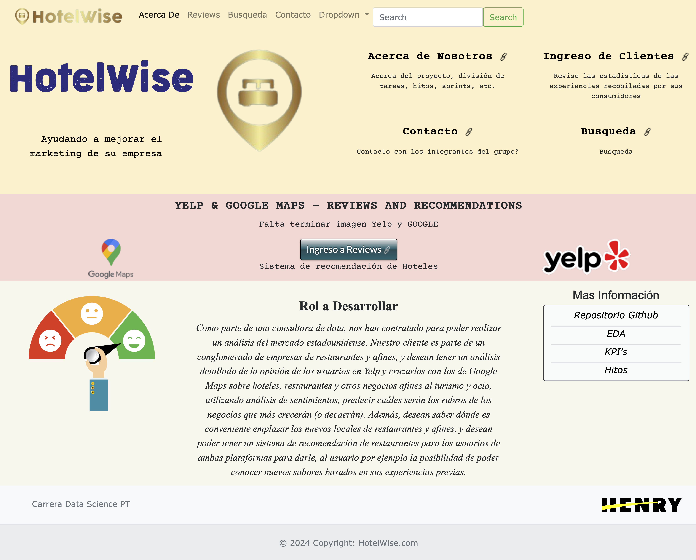

<p align="center">
    
</p>

# Página web del Proyecto <!-- omit in toc --> 

## Indice <!-- omit in toc --> 

- [Descripción](#descripción)
- [Flujo de Trabajo](#flujo-de-trabajo)
- [Objetivos Particulares](#objetivos-particulares)
- [Instalación y Despliegue](#instalación-y-despliegue)
  - [Procedimiento](#procedimiento)
- [Uso](#uso)
- [Frameworks de Trabajo](#frameworks-de-trabajo)
- [Hosting](#hosting)
  - [Despliegue de la aplicacion web de HotelWise](#despliegue-de-la-aplicacion-web-de-hotelwise)
- [Lenguajes de Programación](#lenguajes-de-programación)
- [Ejemplos](#ejemplos)
- [Contribución](#contribución)
- [Créditos](#créditos)
- [Licencia](#licencia)
- [Contacto](#contacto)
- [Enlaces adicionales](#enlaces-adicionales)

## Descripción

La página web de HotelWise es una plataforma diseñada para crear recomendaciones de hoteles.
Permitiendo a los usuarios encontrar la mejor opcion según sus criterios de busqueda, los cuales son curados por una herramienta de Machine Learning para ofrecerle la mejor experiencia en su estadía.

## Flujo de Trabajo

Diagrama de Gantt
<p align="center">
    
</p>

## Objetivos Particulares

Diseño y desarrollo del sitio web del proyecto,  implementando las características y funcionalidades necesarias para poder hacer las mejores recomendaciones de hoteles. Dando a los clientes una experiencia superadora y otorgando información clara sobre sus consultas, haciendo hincapié en la facilidad para navegar el sitio.

## Instalación y Despliegue


Asegúrate de tener Python instalado. Recomiendo usar un entorno virtual para instalar las dependencias del proyecto.

1. Clona este repositorio en tu máquina local.
2. Crea un entorno virtual para trabajar 
3. Instala las dependencias necesarias utilizando el gestor de paquetes de tu elección (por ejemplo, npm o pip).
4. Ejecuta el servidor Django.


Para desplegar la aplicación en Firebase:

1. Configura una cuenta de Firebase.
2. Instala Firebase CLI.
3. Inicializa tu proyecto Firebase.
4. Despliega tu aplicación usando Firebase Hosting.

### Procedimiento

```bash
git clone https://github.com/jgutierrezladino/HotelWise/tree/HotelWiseWeb.git

python3 -m venv myenv
source myenv/bin/activate

pip install -r requirements.txt
```

## Uso

1. Dirigete el directorio principal ```/HotelWise```
2. Ejecuta la aplicación utilizando el comando `npm start` o `python manage.py runserver`.
3. Abre tu navegador web y navega a la URL proporcionada para acceder a la página web de HotelWise.
4. Explora las diferentes funcionalidades de la página web, como búsqueda de reseñas, publicaciones, etc.

## Frameworks de Trabajo

Herramientas y entornos que utiliza el proyecto:

- ```Django```: Framework de desarrollo web de alto nivel en Python que fomenta el desarrollo rápido y limpio.
- ```Bootstrap```: Framework que facilita la creación de interfaces de usuario responsivas y modernas para sitios y aplicaciones web.
- ```Visual Studio Code```: Editor de código fuente desarrollado por Microsoft para Windows, Linux y macOS.
- ```Firebase```: Hosting Web.

## Hosting

Se utilizará el servicio de hosting web de Google Cloud Platform (GCP) que ofrece una variedad de opciones para alojar sitios, aplicaciones y servicios web en la infraestructura global de Google. El hosting web de Google ofrece una plataforma flexible, escalable y segura para alojar tus aplicaciones web y servicios web. Con una variedad de opciones de servicio, integración con otros servicios de GCP y una infraestructura global de alto rendimiento, GCP es una excelente opción para alojar tus proyectos web en la nube.

###  [Despliegue de la aplicacion web de HotelWise](https://github.com/jgutierrezladino/HotelWise/blob/HotelWiseWeb/HotelWise)

## Lenguajes de Programación

Este proyecto utiliza los siguientes:

- ```Python```
- ```HTML```
- ```CSS```
- ```JavaScript```

## Ejemplos

- Mockup de pantalla de la página de inicio:

<p align="center">
    
</p>

- Mockup de pantalla de la búsqueda de reseñas:
<p align="center">
    
</p>

- Primer print de pantalla de la página ```HOME```:

<p align="center">
    
</p>

- Print de pantalla de la página ```HOME``` renombrado y con logo:

<p align="center">
    
</p>

- Print de pantalla de la página ```REVIEWS```:

<p align="center">
    
</p>

## Contribución

¡Estamos abiertos a contribuciones! Si tienes ideas de mejora, problemas que reportar o características nuevas que te gustaría añadir, no dudes en abrir una solicitud de extracción o un problema en este repositorio.

## Créditos

- Desarrollado por (Equipo).
- Logotipo diseñado por (Diseñador).

## Licencia

Este proyecto está bajo las Licencias:

- [Licencia GPL 3.0](LICENSE-GPL).
- [Licencia MIT](LICENSE-MIT).
- [Licencia Apache 2.0](LICENSE-APACHE).

## Contacto

Si tienes alguna pregunta, comentario o problema con la página web de HotelWise, no dudes en ponerte en contacto con nosotros en [mdallanegra@icloud.com](mailto:mdallanegra@icloud.com).

## Enlaces adicionales

- [Documentación completa del proyecto](https://github.com/jgutierrezladino/HotelWise)
- [Repositorio de código fuente](https://github.com/jgutierrezladino/HotelWise/tree/HotelWiseWeb)
- [Sitio web en vivo](https://hotelwiseweb.uk.r.appspot.com)

